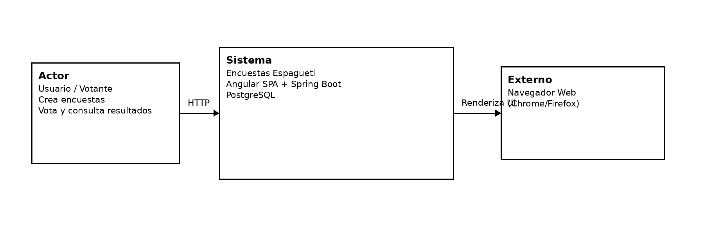
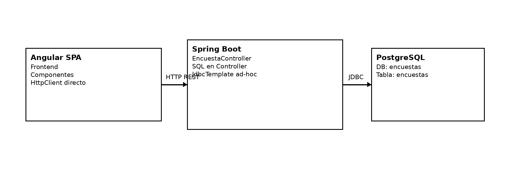
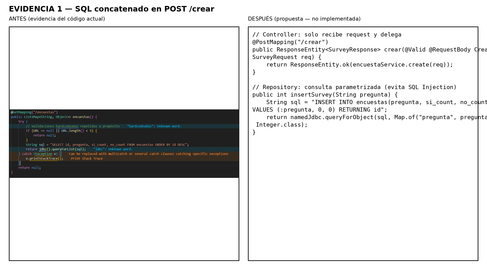
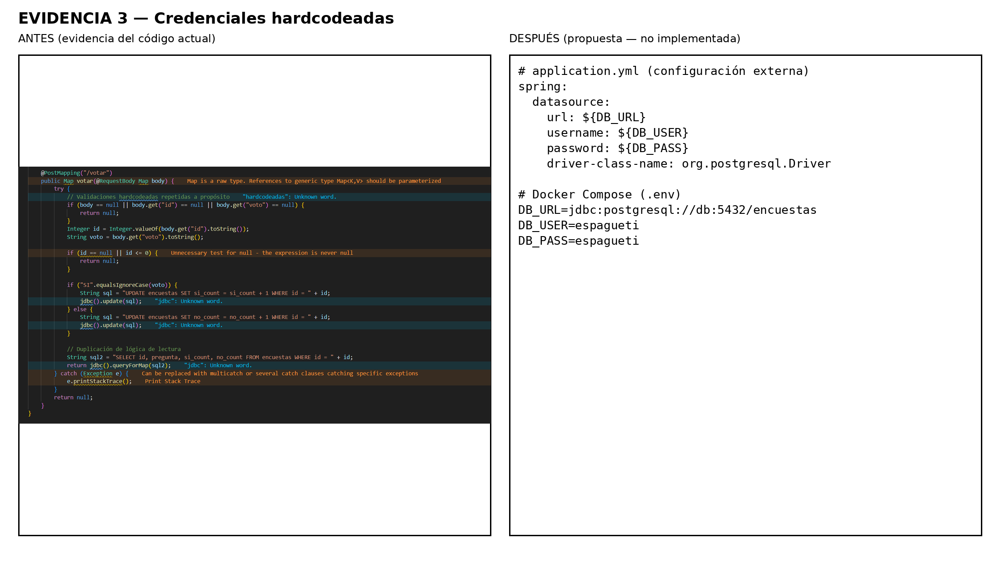
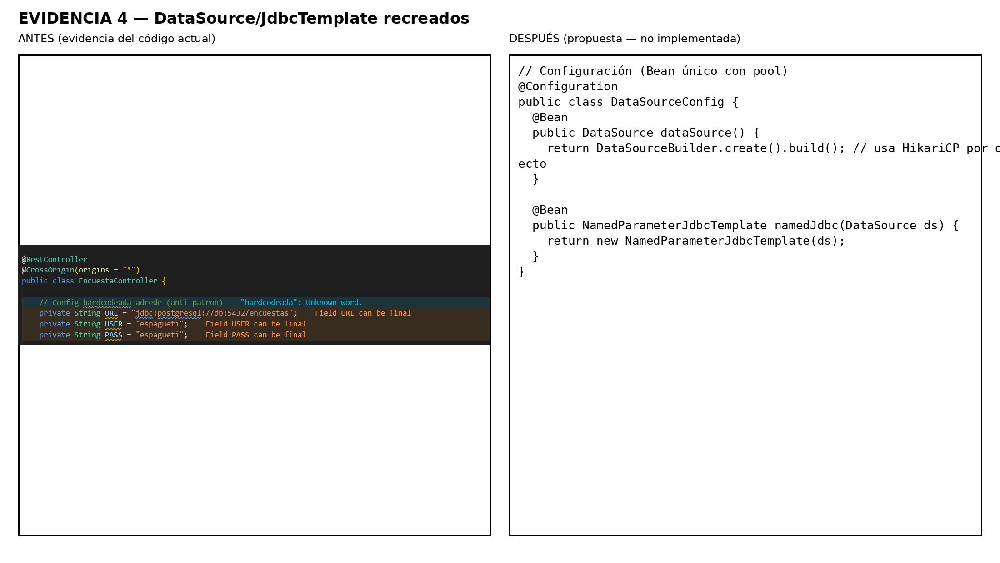
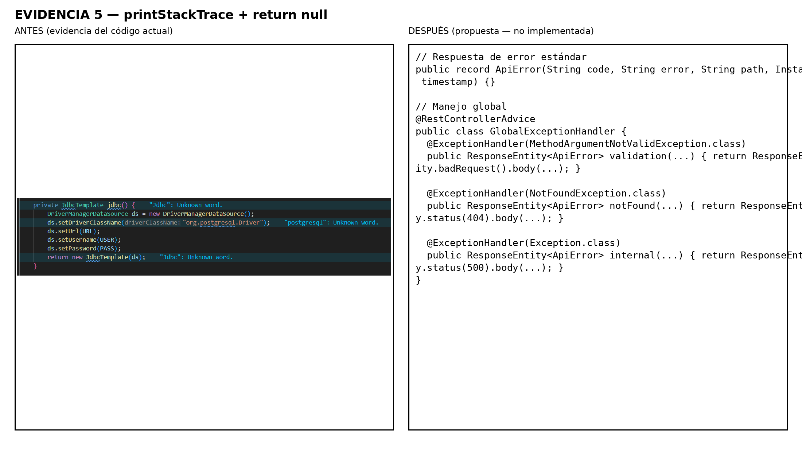
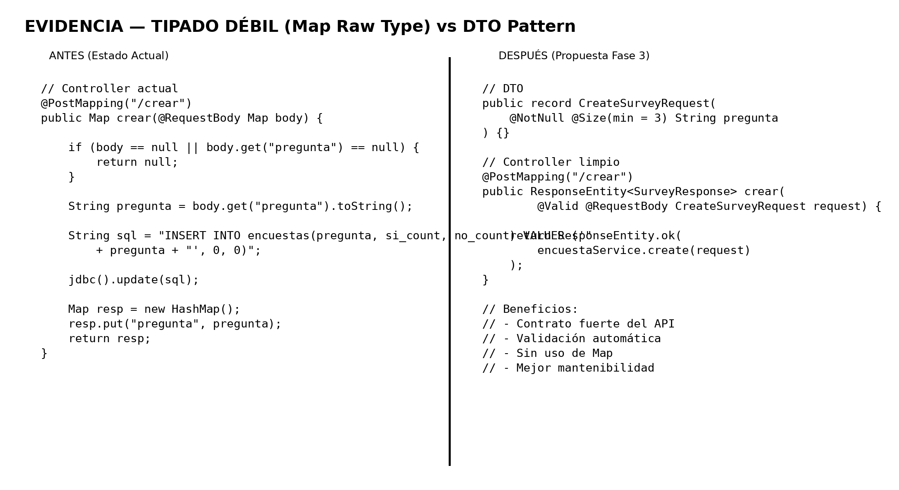
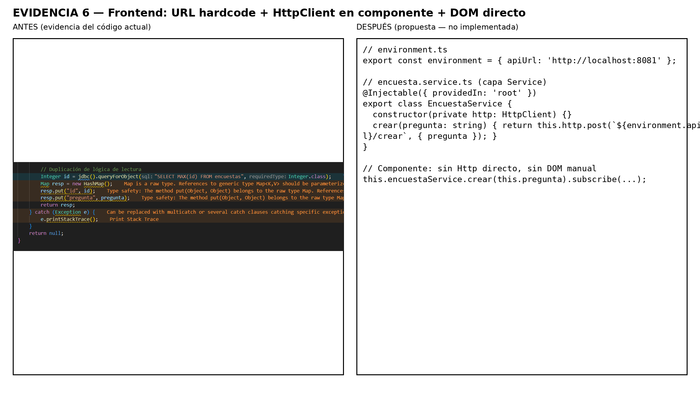

# ✅ FASE 3 — Propuesta de Refactorización Arquitectónica 
**Proyecto:** Encuestas Espagueti  
**Repositorio:** Semana-2  
**Base:** Hallazgos Fase 2 (anti-patrones + instrumentos de casos de uso)  
**Autores:** ---

- Juan Sebastian Osorio Fierro
- Daniel Steve Fontalvo Matiz
- Leonado Fabio Perez Bermudez
- Juan Camilo Cruz Pardo 

**Fecha:** 2026-02-23

---

## 1. Objetivo de la Fase 3
Definir una **propuesta de refactorización arquitectónica** para el sistema "Encuestas Espagueti" con el fin de:

- Reducir vulnerabilidades de seguridad (SQL Injection, credenciales expuestas).
- Disminuir acoplamiento y mejorar mantenibilidad.
- Establecer una arquitectura en capas.
- Fortalecer contratos del API (tipado y errores consistentes).
- Preparar el sistema para escalabilidad y evolución (base para Fase 4).

> **Restricción:** Esta fase es documental. **No se modifica el código**.

---

## 2. Alcance
### Dentro del alcance
- Propuesta de arquitectura objetivo **en capas**.
- Propuesta de patrones y prácticas por problema.
- Diseño de contratos (DTOs) y modelo conceptual.
- Estrategia de manejo de errores y configuración.
- Trazabilidad: Caso de uso → anti-patrón → solución propuesta.

### Fuera del alcance
- Implementación de código.
- Migración real del sistema a microservicios (se aborda en Fase 4).

---

## 3. Arquitectura actual vs arquitectura propuesta

### 3.1 Estado actual (según `EncuestaController`)
El controlador concentra:
- Configuración (URL/USER/PASS hardcode)
- Conexión BD (crea DataSource por request)
- SQL (concatenado)
- Validaciones
- Lógica de negocio (crear/votar)
- Manejo de errores (printStackTrace + return null)
- Respuestas sin contrato tipado (Map)

**Consecuencia:** Alta acoplación + baja testabilidad + riesgo de seguridad.

---

### 3.2 Arquitectura propuesta (target: en capas)

**Capa 1 — Controller**
- Responsable de:
  - Recibir request HTTP
  - Validar entrada mediante DTO (automático)
  - Delegar a Service
  - Retornar ResponseEntity con códigos HTTP correctos

**Capa 2 — Service (Dominio / Aplicación)**
- Responsable de:
  - Reglas de negocio:
    - Crear encuesta
    - Validar existencia de encuesta para votar
    - Registrar voto
  - Orquestar repositorios
  - Aplicar políticas del dominio

**Capa 3 — Repository (Persistencia)**
- Responsable de:
  - Operaciones de datos:
    - insert encuesta
    - findById
    - listAll
    - updateVoteCount
  - Consultas **parametrizadas** (no concatenadas)

**Capa 4 — Configuración**
- Responsable de:
  - DataSource/JdbcTemplate como Beans
  - Variables por entorno (no hardcode)

---

## 4. Propuesta de patrones/prácticas (mínimo 5) con trazabilidad

### 4.1 Matriz Caso de Uso → Problema → Solución propuesta

| Caso de Uso | Endpoint actual | Anti-patrón (Fase 2) | Solución (Fase 3) | Patrón/Práctica |
|---|---|---|---|---|
| CU-01 Crear Encuesta | POST `/crear` | SQL concatenado + Map + return null | DTO + consultas parametrizadas + error handling | DTO Pattern + Prepared Statements + ControllerAdvice |
| CU-02 Listar Encuestas | GET `/encuestas` | Conexión recreada por llamada | Pool/DataSource centralizado | DI + DataSource bean |
| CU-03 Consultar Encuesta | GET `/encuesta/{id}` | SQL concatenado con id | Parametrizar query + manejo 404 | Repository + Exception Handling |
| CU-04 Votar Encuesta | POST `/votar` | Condicional rígido + SQL concatenado | Validación dominio + estrategia de voto | Strategy (opcional) + Service Layer |

---

### 4.2 Patrones y prácticas seleccionadas

#### (1) Layered Architecture (Controller → Service → Repository)
**Problema que resuelve:** Controller “Dios” (violación SRP).  
**Aplicación al caso:** `EncuestaController` deja de contener SQL y conexión.  
**Beneficio:** mantenibilidad, testabilidad, separación de responsabilidades.

---

#### (2) DTO Pattern + Validación declarativa
**Problema:** Requests `Map` sin contrato.  
**Aplicación al caso (conceptual):**
- `CreateSurveyRequest { pregunta }`
- `VoteRequest { id, voto }`
**Beneficio:** contrato explícito + validación consistente + menos repetición.

---

#### (3) Repository Pattern + Consultas parametrizadas
**Problema:** SQL concatenado (inyección).  
**Aplicación al caso:** consultas con parámetros (prepared statements) o Spring Data.  
**Beneficio:** seguridad + robustez + evolución.

---

#### (4) Externalized Configuration
**Problema:** URL/USER/PASS hardcodeados.  
**Aplicación:** `application.properties` / variables de entorno en Docker Compose.  
**Beneficio:** despliegue multi-ambiente + seguridad DevOps.

---

#### (5) Global Exception Handling (`@ControllerAdvice`)
**Problema:** `printStackTrace` + `return null`.  
**Aplicación:** respuestas HTTP estandarizadas:
- 400: validación
- 404: encuesta no existe
- 500: error interno
**Beneficio:** contrato REST consistente y trazable.

---

#### (6) (Opcional recomendado) Service Layer en Angular + environment.ts
**Problema:** URL hardcodeada y HttpClient directo en components.  
**Aplicación:** `EncuestaService` + `environment.apiUrl`.  
**Beneficio:** frontend mantenible y portable.

---

## 5. Contratos propuestos (API) — sin cambiar funcionalidad
> Se mantiene la funcionalidad, se mejora la claridad del contrato.

### 5.1 Endpoints (compatibles con actuales)
- POST `/crear`  → crea encuesta
- GET `/encuestas` → lista encuestas
- GET `/encuesta/{id}` → consulta encuesta
- POST `/votar` → registra voto

### 5.2 Requests esperados (conceptual)
**Crear**
```json
{ "pregunta": "¿Te gusta Java?" }

{ "id": 1, "voto": "SI" }

{ "id": 1, "pregunta": "...", "si_count": 0, "no_count": 0 }

{ "error": "Mensaje", "code": "VALIDATION_ERROR", "timestamp": "..." }
```


## 6. Diagramas Arquitectónicos (C4)

### 6.1 C4 – Nivel 1: Contexto del Sistema



**Descripción:**
El sistema actual permite a un Usuario crear encuestas y votar mediante una SPA Angular que consume una API Spring Boot conectada a PostgreSQL.

Este diagrama muestra la interacción de alto nivel entre:
- Actor Usuario
- Sistema Encuestas Espagueti
- Base de datos PostgreSQL

---

### 6.2 C4 – Nivel 2: Contenedores (Estado Actual)



**Observaciones Arquitectónicas:**
- Angular consume directamente el backend.
- El backend contiene lógica de negocio y SQL en el Controller.
- No existe separación de capas.
- No hay configuración externa.
- No hay pool de conexiones.

Este modelo explica los anti-patrones identificados en Fase 2.

---

### 6.3 C4 – Nivel 2: Contenedores (Propuesta)


**Propuesta Arquitectónica:**
- Angular consume únicamente un API Gateway.
- Se separan bounded contexts:
  - survey-service
  - voting-service
- Cada servicio tiene su propia base de datos.
- Configuración externa.
- Infraestructura desacoplada.

Esto prepara el sistema para microservicios (Fase 4).

---

### 6.4 Arquitectura Backend en Capas (Propuesta Fase 3)


Se propone eliminar el Controller "Dios" y dividir responsabilidades en:

- Controller (HTTP)
- Service (Lógica de negocio)
- Repository (Persistencia)
- Configuración (Infraestructura)

Esto aplica el principio SRP y reduce acoplamiento.

---

# 7. Evidencias del Estado Actual y Comparación Arquitectónica

---

## 7.1 SQL Injection – Concatenación de SQL



**ANTES (Estado actual):**
- Se construye el SQL concatenando variables directamente.
- Permite inyección SQL.
- Rompe separación de responsabilidades.

**DESPUÉS (Propuesta):**
- Repository Pattern.
- Consultas parametrizadas.
- Persistencia aislada del Controller.

Impacto: Se elimina vulnerabilidad crítica de seguridad.

---

## 7.2 Credenciales Hardcodeadas



**ANTES:**
- URL, USER y PASS están en el código fuente.
- No existe configuración externa.

**DESPUÉS:**
- Uso de application.yml.
- Variables de entorno.
- Configuración inyectada por Spring.

Impacto: Seguridad y portabilidad en ambientes DEV/QA/PROD.

---

## 7.3 Creación Manual de DataSource



**ANTES:**
- Se instancia DriverManagerDataSource por request.
- No existe pool de conexiones.

**DESPUÉS:**
- DataSource como Bean Singleton.
- Pool de conexiones (HikariCP).

Impacto: Mejora rendimiento y escalabilidad.

---

## 7.4 Manejo de Errores Deficiente



**ANTES:**
- Uso de printStackTrace.
- Retorno null.
- Sin códigos HTTP adecuados.

**DESPUÉS:**
- @ControllerAdvice global.
- ResponseEntity con códigos 400, 404, 500.
- Error estructurado.

Impacto: API consistente y profesional.

---

## 7.5 Tipado Débil (Uso de Map)



**ANTES:**
- Uso de Map sin tipado.
- Validaciones manuales repetidas.

**DESPUÉS:**
- DTO Pattern.
- Validación declarativa (@NotNull, @Size).
- Contrato fuerte del API.

Impacto: Mantenibilidad y seguridad de tipos.

---

## 7.6 Problemas en Frontend



**ANTES:**
- URL hardcodeada.
- HttpClient directo en componente.
- Manipulación directa del DOM.

**DESPUÉS:**
- Service Layer en Angular.
- environment.ts.
- Data binding y AsyncPipe.

Impacto: Arquitectura limpia en frontend.

---

# 8. Síntesis Arquitectónica de la Refactorización

La Fase 3 demuestra que los anti-patrones identificados no son aislados, sino consecuencia de:

- Ausencia de arquitectura en capas.
- Falta de separación de responsabilidades.
- Violación de principios SOLID.
- Diseño orientado a implementación y no a arquitectura.

La propuesta arquitectónica:

✔ Elimina vulnerabilidades críticas  
✔ Reduce acoplamiento estructural  
✔ Mejora rendimiento  
✔ Mejora mantenibilidad  
✔ Prepara el sistema para microservicios (Fase 4)

---

---

# 9. Architecture Decision Records (ADR)

---

## ADR-001 — Separación en Arquitectura por Capas

**Estado:** Aceptada  
**Fecha:** 2026-02-23  

### Contexto
El sistema actual concentra lógica de negocio, acceso a datos, configuración y manejo de errores dentro de `EncuestaController`, generando alta acoplación y violación del principio SRP.

### Problema
La ausencia de separación de responsabilidades:
- Dificulta el mantenimiento.
- Impide testeo unitario adecuado.
- Genera duplicación de código.
- Aumenta riesgo de errores futuros.

### Decisión
Adoptar una arquitectura en capas:

- Controller → Manejo HTTP.
- Service → Reglas de negocio.
- Repository → Persistencia.
- Configuración → Infraestructura desacoplada.

### Alternativas consideradas
1. Mantener estructura actual.
2. Migrar directamente a microservicios.
3. Aplicar arquitectura en capas progresivamente.

Se selecciona la opción 3 por menor impacto y transición controlada.

### Consecuencias

**Positivas:**
- Mejor mantenibilidad.
- Mayor cohesión.
- Facilita evolución futura.

**Negativas:**
- Aumento en número de clases.
- Mayor estructura inicial.

---

## ADR-002 — Eliminación de SQL Concatenado

**Estado:** Aceptada  
**Fecha:** 2026-02-23  

### Contexto
Las consultas SQL se construyen mediante concatenación de strings en múltiples métodos.

### Problema
- Vulnerabilidad a SQL Injection.
- Falta de separación de persistencia.
- Riesgo de manipulación de datos.

### Decisión
Implementar consultas parametrizadas mediante:

- Prepared Statements
- NamedParameterJdbcTemplate
- O Spring Data JPA (opcional)

### Alternativas consideradas
1. Validar manualmente strings.
2. Usar ORM completo.
3. Parametrizar consultas actuales.

Se selecciona parametrización progresiva por compatibilidad.

### Consecuencias

**Positivas:**
- Eliminación de vulnerabilidad crítica.
- Mayor robustez.

**Negativas:**
- Requiere refactorización del acceso a datos.

---

## ADR-003 — Externalización de Configuración

**Estado:** Aceptada  
**Fecha:** 2026-02-23  

### Contexto
Las credenciales de base de datos están hardcodeadas en el código fuente.

### Problema
- Riesgo de exposición.
- No portable entre entornos.
- Mala práctica DevOps.

### Decisión
Mover configuración a:

- application.yml
- Variables de entorno
- Docker Compose (env)

### Alternativas consideradas
1. Mantener credenciales en código.
2. Usar archivo externo manual.
3. Configuración estandarizada Spring Boot.

Se selecciona la opción 3 por alineación con buenas prácticas.

### Consecuencias

**Positivas:**
- Seguridad mejorada.
- Despliegue multi-ambiente.
- Mejor integración CI/CD.

**Negativas:**
- Requiere configuración adecuada del entorno.

---

## ADR-004 — Manejo Global de Errores

**Estado:** Aceptada  
**Fecha:** 2026-02-23  

### Contexto
El sistema utiliza `printStackTrace()` y `return null` ante excepciones.

### Problema
- Respuestas HTTP inconsistentes.
- Falta de trazabilidad.
- Riesgo de NullPointerException en frontend.

### Decisión
Implementar:

- @ControllerAdvice
- Respuestas estandarizadas
- Uso de ResponseEntity

### Alternativas consideradas
1. Continuar con manejo manual.
2. Crear manejo local por método.
3. Implementar manejador global.

Se selecciona manejador global por consistencia.

### Consecuencias

**Positivas:**
- API profesional.
- Mejor monitoreo.
- Mejor experiencia cliente.

**Negativas:**
- Requiere diseño de estructura de error común.

---

## ADR-005 — Introducción de Service Layer en Angular

**Estado:** Aceptada  
**Fecha:** 2026-02-23  

### Contexto
Los componentes Angular utilizan HttpClient directamente y URLs hardcodeadas.

### Problema
- Violación del patrón recomendado Angular.
- Lógica mezclada con presentación.
- No portable a producción.

### Decisión
Implementar:

- EncuestaService
- environment.ts
- Eliminación de manipulación directa del DOM

### Alternativas consideradas
1. Mantener estructura actual.
2. Reescribir frontend completo.
3. Introducir capa Service progresivamente.

Se selecciona opción 3 por bajo impacto.

### Consecuencias

**Positivas:**
- Frontend desacoplado.
- Código más mantenible.
- Mejores pruebas unitarias.

**Negativas:**
- Requiere reorganización de componentes.

---

# 10. Conclusión Arquitectónica Final

La Fase 3 formaliza decisiones estructurales que permiten:

- Corregir vulnerabilidades críticas.
- Reducir acoplamiento estructural.
- Aplicar principios SOLID.
- Mejorar rendimiento y mantenibilidad.
- Establecer una base sólida para la transición a microservicios (Fase 4).

Los ADRs documentan explícitamente las decisiones técnicas adoptadas, garantizando trazabilidad arquitectónica y justificando el rediseño propuesto.